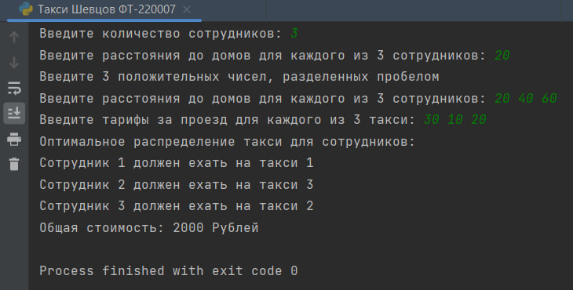
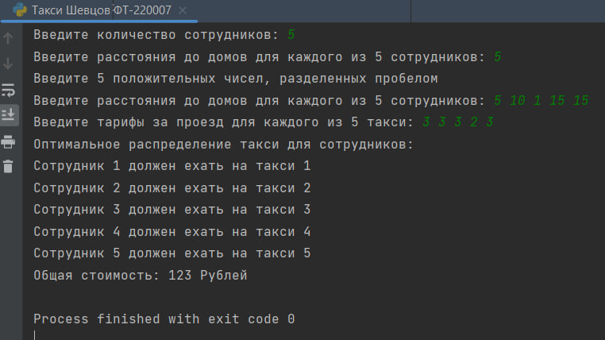

# Исполнитель
Шевцов Михаил
Фт-220007

# Лабораторная работа №8 - Такси
Пользователь вводит кол-во сотрудников, расстояния до их домов и тарифы такси за 1 км. Программа выводит кол-во такси и цену каждой поездки

# Среда разработки
Язык программирования Python
Среда разработки PyCharm Edu 2022.2.2

# Инструкция по работе
Чтобы запустить программу, нужно открыть файл с названием “Такси Шевцов Фт-220007.py” в любом компиляторе кода, поддерживающем язык Python, начать тест и следовать указаниям программы.

## Тесты
Тест 1
___

___
Тест 2
___

